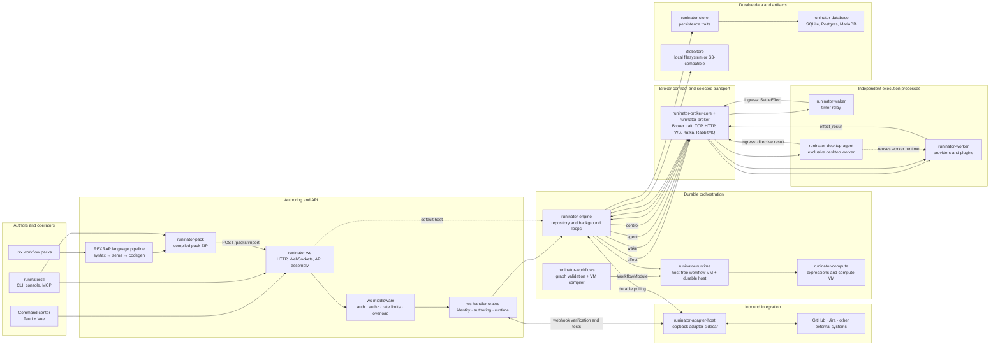

# Runinator Architecture

Runinator is a Rust workspace for authoring, scheduling, and executing workflows across a small local or distributed runtime. Workflows compile to immutable VM modules: durable continuations record instruction state, yield effects through a broker, and resume only when a result or scheduled wake settles the effect.

The design keeps three concerns separate:

- **Authoring and control plane** — the CLI and command center compile and manage workflows through the authenticated HTTP/WebSocket service.
- **Durable orchestration** — the engine drives the workflow VM, persists state, dispatches effects, consumes results, and reconciles triggers and maintenance work.
- **Execution plane** — workers, wakers, background engines, and the archiver communicate their
  availability to the durable engine through broker ingress. They never write replica records
  directly to the database; web services self-register because they own the control-plane store.

## System overview

`runinator-ws` embeds the engine in the default topology. Deployments that need to scale HTTP and background work independently instead run `runinator-engine-worker` against the same database and broker; it hosts the same `runinator-engine` library rather than introducing another execution path.

Compiled action nodes store successful results in durable continuation locals before following
their outgoing edges. The evaluator exposes these bindings as `steps.<node>.output` for node
references in conditions, later action inputs, and workflow outputs. Explicit bytecode stores the
binding; source maps only project execution locations. Failed actions follow their failure edges
without publishing a successful output binding.

## Major boundaries

### API and user-facing clients

`runinator-ws` is the HTTP/WebSocket assembly crate. Its smaller companion crates divide responsibility deliberately:

- `runinator-ws-core` owns wire models, response envelopes, UI events, and OpenAPI vocabulary.
- `runinator-ws-middleware` owns authentication, authorization, rate limiting, and overload protection.
- `runinator-ws-identity`, `runinator-ws-authoring`, and `runinator-ws-runtime` own their domain handlers and route registrations.

The Tauri command center presents the web service; it does not host a worker or execute provider actions. `runinatorctl` is the terminal control client, and its console and MCP server dispatch through the same command surface as its normal command-line interface.

### Workflow definition and evaluation

REXRAP is the authored workflow language. The language family is split by compile stage: `runinator-rexrap-syntax` parses and formats, `runinator-rexrap-sema` resolves and type-checks, and `runinator-rexrap-codegen` lowers to or decompiles from the workflow model. `runinator-rexrap` is the public facade and unified `.rrx` container front end; `runinator-rexrap-ide` adds editor completion and hover without affecting compilation.

`runinator-workflows` validates graphs, node parameters, types, and graph invariants, then compiles a
frozen definition to versioned `WorkflowModule` bytecode when a run starts. It builds on
`runinator-compute`, which evaluates references, templates, conditions, compute programs, and
intrinsic functions without knowing about workflow graphs. `runinator-runtime` executes only those
compiled modules.

Pack compilation is client-side. `runinator-pack` compiles `.rrx` sources into a workflow bundle, `runinator-pack-wire` defines the compiled ZIP wire format, and the web service imports the compiled JSON without recompiling source.

### Durable orchestration

`runinator-runtime` contains the host-free continuation interpreter and `WorkflowVmHost`. A run can
have multiple durable continuations—one for each live thread of control—so parallel, race, and map
branches are independent fibers rather than one mutable node position. The interpreter returns a
durable boundary (`Yield`, `Fork`, `Joined`, terminal, or interrupt); the host commits it through
`WorkflowVmStore`. The crate has no HTTP server, concrete broker, or SQL implementation.

`runinator-engine` is that runtime's durable orchestrator. Its loops lease and drive runnable
continuations, fire triggers, drain durable effect dispatches, consume effect results and ingress
commands, handle effect retry/deadline policy, publish wakes and agent directives, and run
repository maintenance. Its repository layer coordinates persistence through trait contracts
rather than placing persistence logic in the web handlers.

### Inbound adapters and correlated orchestration

Inbound orchestration adapters are deliberately separate from outbound providers. `runinator-adapter-host` runs adapter code on loopback only: authoring handlers use it for kind discovery, webhook verification, and adapter tests, while the engine uses it for durable polling. It ships as a sidecar of the web-service and standalone-engine pods, not as a network Service. The adapter client, shared request contract, and SDK keep both call paths on one authenticated protocol.

An admitted pipeline can additionally carry an orchestration policy. The engine binds each admitted scope and correlation key to a durable generation, pins the pipeline revision, then applies intent priority, coalescing, phase output mapping, workspace leases, and retry budgets. This makes later webhooks and polls converge on one durable orchestration rather than independently starting duplicate workflow runs.

### Brokered execution

`runinator-broker-core` defines the backend-neutral `Broker` trait, delivery wrappers, and in-memory implementation. `runinator-broker` adds the selectable TCP, HTTP, WebSocket, Kafka, and RabbitMQ transports. The serializable commands and results that cross those boundaries live in `runinator-comm`. Components that only publish or receive through `dyn Broker` depend on the core crate; binaries that construct a backend use the transport crate.

The core execution message paths are:

- The engine publishes provider `effect` commands; workers resolve a provider or plugin, execute it, and publish an `effect_result`.
- The engine turns a known future completion into a `wake`. The waker waits and relays the prebuilt result on `ingress` as `SettleEffect`; the engine's normal result-settlement path then processes it.
- API-originated control travels through the engine and the `control` channel. Durable desktop/replica directives use the `agent` channel, and their replies return through `ingress`.

The `effect`, `control`, and `agent` paths are target-routed. `events` is the exception: it is fan-out so every web-service replica can update its connected WebSocket clients. There is intentionally no worker-to-waker or waker-to-worker channel.

### Persistence and artifacts

`runinator-models` and `runinator-comm` are the shared domain and wire-contract foundations.
`runinator-store` declares persistence roles, including `WorkflowVmStore` for modules,
continuations, effects, and journal entries, plus the focused `RuntimeStore` used by engine-level
run orchestration. `runinator-database` provides their SQLite, Postgres, and MariaDB implementations
and owns SQL mapping. This keeps database behavior out of the HTTP handler and runtime crates.

Workflow modules, continuations, effect receipts and dispatches, journal entries, triggers, and
metadata are durable database records. A graph cursor shown to an operator is a source-map
projection of a continuation's instruction pointer, not separate execution state. Artifact bytes
are different: `runinator-blob-core` defines `BlobStore`, while `runinator-blob` supplies the
S3-compatible client/server transport. The engine's artifact-storage boundary writes bytes to the
object store and persists their `blob://` references; workers upload produced bytes through the API
before reporting artifact events.

## Runtime lifecycle

1. An operator imports a client-compiled pack or starts a run through the command center or `runinatorctl`.
2. The web service authenticates and authorizes the request, then delegates its durable work to the engine.
3. Run creation snapshots the definition and resolved configuration, compiles the definition to a
   versioned `WorkflowModule`, and atomically stores the module, root continuation, and first journal
   entry with the public run.
4. The engine leases runnable continuations and drives each module until the interpreter yields a
   durable boundary. A provider request atomically parks the continuation and creates an effect
   receipt plus dispatch. A worker executes it and returns an `effect_result`; settlement makes the
   continuation runnable for another drive.
5. Timed infrastructure effects do not occupy an engine task. The engine publishes a due-time `wake`; the stateless waker relays the already-built settlement back through `ingress` at that time.
6. Each non-web-service runtime also announces startup, heartbeat, and clean shutdown through
   `ingress`; the engine persists those observations in the fleet registry.
7. An inbound adapter can verify a webhook or claim a due poll; the normalized event enters the
   same durable admission path as any other ingress event.
8. When the last real continuation retires, the runtime transitions the run to its terminal status. Results, logs, events, and artifacts remain durable and available through the API.

## Extension guide

Keep dependency direction from service and execution crates toward shared contracts:

- Add a workflow node in `runinator-workflows`, then teach the runtime its behavior; do not encode graph rules in a web handler or provider.
- Add persistence operations to the owning `runinator-store` role, with the implementation and database mapping in `runinator-database`.
- Add shared broker payloads to `runinator-comm` and implement them across every relevant broker backend and consumer.
- Add a provider as a dedicated `runinator-provider-<name>` crate, resolved by `runinator-worker`; providers do not schedule work or write directly to the database.
- Keep reusable container execution in `runinator-sandbox`, provider loading in `runinator-plugin`, and binary startup/configuration in the platform and bootstrap crates.

This separation lets the default local supervisor stack use one embedded engine with SQLite and the built-in broker, while production can independently scale web-service, engine, worker, waker, broker, database, and object-store replicas without changing workflow semantics.
